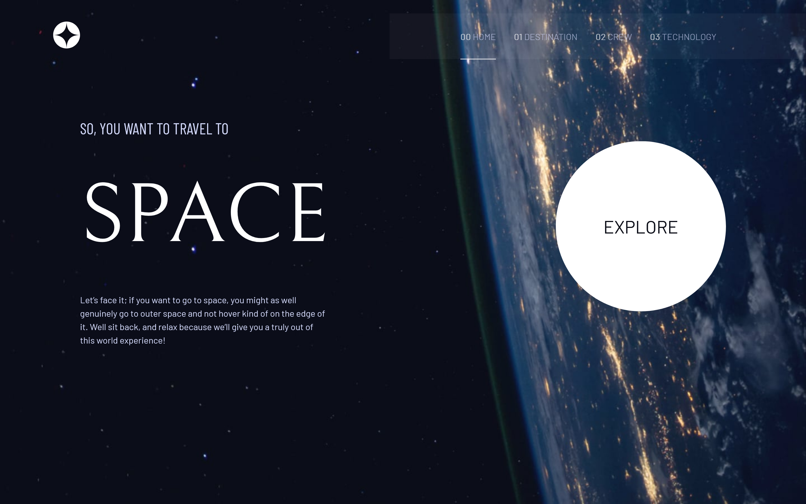
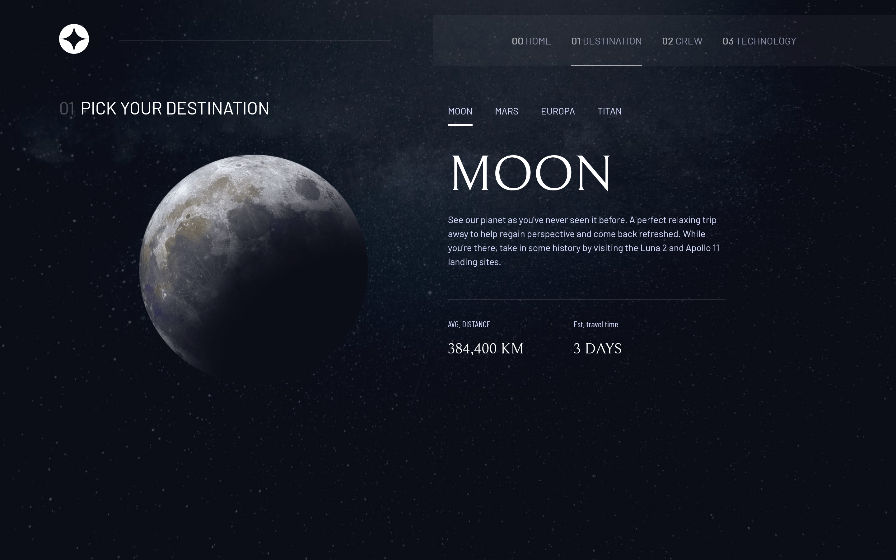
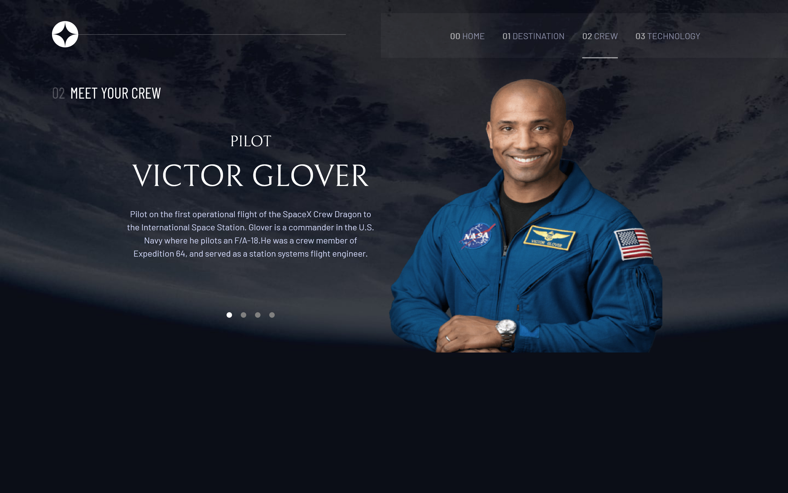

# Frontend Mentor - Space tourism website solution

This is a solution to the [Space tourism website challenge on Frontend Mentor](https://www.frontendmentor.io/challenges/space-tourism-multipage-website-gRWj1URZ3). Frontend Mentor challenges help you improve your coding skills by building realistic projects.

## Table of contents

- [Overview](#overview)
  - [The challenge](#the-challenge)
  - [Screenshot](#screenshot)
  - [Links](#links)
- [My process](#my-process)
  - [Built with](#built-with)
  - [What I learned](#what-i-learned)
  - [Continued development](#continued-development)
- [Author](#author)

**Note: Delete this note and update the table of contents based on what sections you keep.**

## Overview

### The challenge

Users should be able to:

- View the optimal layout for each of the website's pages depending on their device's screen size
- See hover states for all interactive elements on the page
- View each page and be able to toggle between the tabs to see new information

### Screenshot






### Links

<!-- - Solution URL: [Add solution URL here](https://your-solution-url.com) -->

- Live Site URL: [hosted on netlify](https://yusuffspacetourism.netlify.app)

## My process

### Built with

- Semantic HTML5 markup
- CSS custom properties
- Flexbox
- CSS Grid
- Mobile-first workflow
- [vite](https://vitejs.dev) - A development tool

### What I learned

I learnt how to use javascript to render content into my html from data.json file using the code below

```js
const getCrewInformation = (crew) => {
  fetch("../data.json")
    .then((res) => res.json())
    .then((data) => {
      //   console.log(data);
      let crewInfo;
      let crewList = data.crew;
      for (const crewObject of crewList) {
        if (crewObject.name.toLowerCase() === crew.toLowerCase()) {
          crewInfo = crewObject;
        }
      }
      crewsImage.setAttribute("src", `  .${crewInfo.images.png}`);
      crewsImage.setAttribute("alt", `  .${crewInfo.name} image.`);
      crewRole.innerText = crewInfo.role.toUpperCase();
      crewName.innerText = crewInfo.name.toUpperCase();
      crewBio.innerText = crewInfo.bio;
    });
};
```

### Continued development

I am currently comfortable with css so i am diving into the world of javascript, although we can't learn everything completely the goal is to keep on learning

## Author

<!-- - Website - [Add your name here](https://www.your-site.com) -->

<!-- - Frontend Mentor - [@yourusername](https://www.frontendmentor.io/profile/yourusername) -->

- Twitter - [@\_ysf_a](https://twitter.com/_ysf_a)
